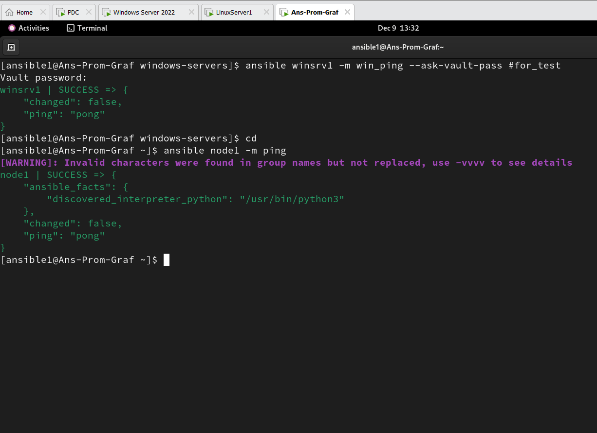

# Enterprise-Level-Monitoring-Project
Monitoring + AD Integration + Linux Domain Join + Windows Exporter + Linux Exporter + Ansible Automation

## Architecure
 VM1 → Windows Server (192.168.142.100)
       + Active Directory (Domain Controller) 
       + Windows Exporter (via Ansible)

 VM2 → Linux Server (192.168.142.222)
       + Ansible
       + Prometheus
       + Grafana
 
 VM3 → Linux Server 
       + Node Exporter (via Ansible)

## Quick architecture (what we have)

VM1 (Control) [192.168.142.222] — Ansible controller + Prometheus + Grafana

VM2 (AD / DC)[192.168.142.100] — Windows Server running Active Directory + DNS (domain controller) 

VM3 (Linux node) [192.168.142.225] — target Linux (Node Exporter) — joined to AD

VM4 (Windows node) [192.168.142.150] — target Windows (windows_exporter) — joined to AD

## Preparing Environment
**Preparing Windows Vms**
Active Directory installatiion, joining windows server to domain (ITI.LOCAL) and creating domain user ansible   
- Ansible will connect to windows servers through winrm service on windows servers (opened ports 5985) 
- user ansible can login to all windows servers joined the domain 

Add gpo (ansible-gpo) that will add ansible user to the the local administrators group on all windows servers joined to the domain and then deny it from local and remote login to all windows servers
 create OU called All-Windows-Servers  and link the gpo (ansible-gpo) to it 
---
Computer Configuration → Preferences → Control Panel Settings → Local Users and Groups → New → Local Group (Administrators) *and add ansible user to this group*
---
Computer Configuration → Policies → Windows Settings → Security Settings → Local Policies → User Rights Assignment → Deny log on locally *and add ansible user to this group*
---
Computer Configuration → Policies → Windows Settings → Security Settings → Local Policies → User Rights Assignment → Deny log on through Remote Desktop Services *and add ansible user to this group*
---
- after applying the group policy the ansible user cannot login the windows servers

**Preparing Linux Vms**
## 🔧 Preparing the Linux VMs Environment

Before configuring Ansible, each Linux VM is joined to the Active Directory domain.
This step is critical for several reasons:

- Centralized identity management:
  Joining the Linux nodes to the domain allows all authentication to be handled by Active Directory. This gives the environment the same level of identity governance used in real enterprise infrastructures.

- Consistent hostname resolution:
  Once the Linux VMs become domain members, every node is automatically registered in the domain DNS. This allows Ansible to communicate with the servers using their hostnames instead of IPs, which is far more   stable and scalable.

- Unified access control:
  By joining to AD, we can apply domain-level policies to Linux machines (sudo mappings, SSH access rules, service accounts), ensuring the same access standards across Windows and Linux.

- Better maintainability & clean inventory:
  Ansible’s inventory becomes clean and simple: only server names—no IPs, no hard-coded credentials.
  
Example:
```
[linux_nodes]
node1
node2
```
This approach mirrors how large organizations manage hybrid Linux/Windows fleets, ensuring reliability, security, and easier long-term automation.

### 🔹 Preparing Linux Server for Domain Join (Offline Environment)

Before joining the Linux server to the Active Directory domain, the system must have several required packages installed (such as **realmd, sssd, adcli, samba, krb5, chrony**, etc.).
These packages are necessary for Kerberos authentication, SSSD communication, and the domain join process.

But in our case, the server is **offline** and cannot reach the internet — so **dnf** has no source to download these packages from.

Because of this, we need to create a **Local Repository**.

Since the OS was installed from an **ISO image**, this ISO already contains all the packages that the server may need.
So the solution is:

1. **Mount the ISO** (the same ISO used during OS installation)
2. **Create a Local Repository file** that points to the mounted ISO
3. This way, when the server needs any package, **dnf will search inside the local ISO repository instead of the internet**

In short:

> The server is offline → dnf has no external repos
> We mount the OS ISO → all required packages are inside it
> We create a Local Repo pointing to the mounted ISO
> Now dnf can install all packages needed for the Domain Join process


> dnf config-manager --enable Local-BaseOS Local-AppStream


**
Before performing the domain join, I also need to change the server hostname.
This is important because the hostname is what gets registered inside **DNS** and inside **Active Directory**, so it must be correct **before** joining the domain.

I also need to configure the **time, timezone, and NTP** properly.
Kerberos authentication is very strict with time, and the domain join will fail if the server time is not synchronized with the Domain Controller.
So the time must be fully correct before running the join command.
**
```
###mount iso
-----------------------------------
df -h
mount /dev/sr0 /media/
ls /media


====================================
##create local repo
--------------------------------------
cd /etc/yum.repos.d/
nano local.repo
==
[Appstream]
name=appstream
baseurl=file:///media/AppStream/
enabled=1
gpgcheck=0

[BaseOs]
name=baseos
baseurl=file:///media/BaseOS/
enabled=1
gpgcheck=0

==
yum repolist
#dnf config-manager --disable baseos appstream extras-common

======================================
##change hostname
-------------------------------------
hostnamectl set-hostname Prometheus
bash


##sync time from 192.168.142.100
------------------------------------
#tar xfvz tzdata2024a.tar.gz
tar xfvz tzdata2025b.tar.gz
#zic Africa
zic africa
nano /etc/chrony.conf
==
server 192.168.142.100 iburst
==
systemctl enable --now chronyd.service
systemctl restart chronyd.service
timedatectl
chronyc sources
timedatectl
```


then the server is ready to join to the domain iti.local

```
##join the domain
----------------------------------
yum install sssd realmd oddjob oddjob-mkhomedir adcli samba-common samba-common-tools krb5-workstation openldap-clients policycoreutils-python-utils -y
realm join -v --user=elham iti.local
realm list
nano /etc/sssd/sssd.conf

==
default_domain_suffix = iti.local
dyndns_update = truedyndns_update = True
ad_hostname = %h.%d               # hostname.full_domain
dyndns_refresh_interval = 43200   #to_renew_dns_record_every_12_hours
dyndns_update_ptr = true
dyndns_auth = GSS-TSIG
==
#kinit elham@ITI.LOCAL
#klist
systemctl restart sssd
realm list
```

we will do the same for the other vm (node1) and join it the domain 

installing ansible on vm linux (controller)

In a standard enterprise setup using RHEL servers, Ansible Core can be installed directly from the mounted RHEL installation ISO, since the required packages are already included.

However, in this project I am using CentOS Stream 9, whose installation ISO does not provide Ansible Core. Therefore, I installed Ansible Core from the EPEL repository right after creating the VM, before proceeding with the domain join and the rest of the configuration.

```
sudo yum update -y   # update system 
sudo yum install epel-release -y
sudo yum install ansible -y
ansible --version
```
## Prerequisites

Before running the Ansible playbooks, ensure the following **on each target server**:

1. **Create a local user on all Linux servers**  
   A local user named `ansible1` must exist on each target server. This user will be used by Ansible to connect and execute tasks.

2. **Set a secure password for the user**  
   Make sure to set a strong password for `ansible1`. This password can be used temporarily if password-based authentication is enabled, but it is recommended to configure **SSH key-based authentication** for enhanced security.

3. **Grant sudo privileges**  
   The `ansible1` user must have passwordless sudo access to perform administrative tasks. You can add the following line to the sudoers file using `visudo`:

```
sudo useradd ansible1 #this user is special to ansible for ssh (linux servers) 
sudo passwd ansible1
#to grant ansible1 usr sudo permissions with no password
echo "ansible1 ALL=(ALL) NOPASSWD: ALL" | sudo tee /etc/sudoers.d/ansible1    #or can be added directly to /etc/suduoers
su - ansible1
ssh-keygen -t rsa -b 4096
```
In this environment, Linux hosts are not automatically registered in DNS.
To avoid unnecessary DNS changes and approval workflows, hostname resolution
is handled locally using /etc/hosts, while Ansible inventory relies on hostnames only.

```
sudo nano /etc/hosts
==
192.168.142.225    node1     node1
==
ssh-copy-id ansible1@node1  
sudo nano /etc/ansible1/hosts
==
[linux_nodes]
node1
==
ansible -m ping linux_nodes    #for test
#pywinrm install (package requird for linux to deal with windows)
sudo apt install python3-pip -y
```
as serevr is **ofline** you can download PyWinRM and its dependencies on a device with internet access, then transfer and install it on the offline server.

so on your online device
```
mkdir pywinrm_offline   # Create a folder to store PyWinRM packages
cd pywinrm_offline
pip download pywinrm    # Download PyWinRM and its dependencies
scp *.whl ansible1@192.168.142.222:/tmp/pywinrm_offline/          # Transfer all downloaded files to the offline server
```
On the offline Ansible control server:
```
cd /tmp/pywinrm_offline

pip install --user --no-index --find-links=. pywinrm   #--no-index option tells pip to avoid looking online, and --find-links= points to the local folder containing the packages.
pip show pywinrm | grep Version
```

## Separate Inventory for Windows Hosts

This project keeps **Linux and Windows inventories separate** for clarity and security.

### Create a dedicated folder for Windows inventory
On your Ansible control server, create a new folder for all Windows hosts:
```
su - ansible1
cd
mkdir windows-servers
cd windows-servers

```
### Create a Windows Inventory File

Inside windows-servers, create your inventory file, e.g., inventory.ini:
```
nano inventory.ini
===
[all:vars]
ansible_user=iti\ansible
ansible_password="{{ ansible_password }}"
ansible_connection=winrm
ansible_winrm_port=5985
ansible_winrm_server_cert_validation=ignore
ansible_winrm_transport=ntlm

#[DomainController]
#pdc ansible_host=192.168.142.100

[windows_nodes]
winsrv1 ansible_host=192.168.142.150
===
```

Sensitive credentials like ansible_password are referenced via Ansible Vault.

This ensures no plain passwords are stored in the inventory.

## Handling Vault Password: Create, Use, and Secure

This project uses Ansible Vault to protect sensitive data and credentials.
Follow these practical steps to create a vault password file, configure ansible.cfg, and run playbooks safely.

Step 1: Create a Vault Password File
### Create a file containing only the vault password (replace <your-password>)
```
echo '<your-password>' > /home/ansible1/windows-servers/.vault_pass.txt
```

### Restrict file permissions so only the Ansible user can read it
```
chmod 600 /home/ansible1/windows-servers/.vault_pass.txt
```

Step 2: Configure Ansible to Use the Vault Password File

In your project’s ansible.cfg (or create one inside windows-servers), add:
```
nano /home/ansible1/windows-servers/ansible.cfg
===
[defaults]
vault_password_file = /home/ansible1/windows-servers/.vault_pass.txt
inventory = /home/ansible1/windows-servers/inventory.ini
===
```
Step 3: Create or Edit Vaulted Files
### Create a new vaulted file for storing credentials
```
ansible-vault create /home/ansible1/windows-servers/group_vars/all/vault.yml
===
ansible_password: "DOMAIN_USER_REAL_PASSWORD"
===
```
### Edit an existing vaulted file
```
ansible-vault edit /home/ansible1/windows-servers/group_vars/all/vault.yml
```

Store sensitive data like ansible_password in these vaulted files.

Reference them in your inventory using {{ ansible_password }}
```
ansible windows_nodes -m win_ping --ask-vault-pass #for_test
```




to install prometheus on linux vm 
```
sudo useradd --no-create-home --shell /bin/false prometheus
sudo mkdir /etc/prometheus
sudo mkdir /var/lib/prometheus
sudo chown prometheus:prometheus /var/lib/prometheus

cd /tmp/
wget https://github.com/prometheus/prometheus/releases/download/v2.35.0/prometheus-2.35.0.linux-amd64.tar.gz
-------------------------------------------------------------------------------------------------------
#or you can download it from 
https://github.com/prometheus/prometheus/releases/download/v2.35.0/prometheus-2.35.0.linux-amd64.tar.gz
#and then transfer it to the server 
--------------------------------------------------------------------------------------------------------

tar -xvf prometheus-2.35.0.linux-amd64.tar.gz
cd prometheus-2.35.0.linux-amd64/

sudo mv console* /etc/prometheus 
sudo mv prometheus.yml /etc/prometheus
sudo chown -R prometheus:prometheus /etc/prometheus
sudo mv prometheus /usr/local/bin/
sudo chown prometheus:prometheus /usr/local/bin/prometheus

sudo vi /etc/systemd/system/prometheus.service
============================================================
[Unit]
Description=Prometheus
Wants=network-online.target
After=network-online.target

[Service]
User=prometheus
Group=prometheus
Type=simple
ExecStart=/usr/local/bin/prometheus \
  --config.file=/etc/prometheus/prometheus.yml \
  --storage.tsdb.path=/var/lib/prometheus \
  --web.console.templates=/etc/prometheus/consoles \
  --web.console.libraries=/etc/prometheus/console_libraries

Restart=always

[Install]
WantedBy=multi-user.target
==============================================================
sudo semanage fcontext -a -t bin_t "/usr/local/bin/prometheus"
sudo restorecon -v /usr/local/bin/prometheus
sudo setenforce 1
###open-needed-port-9090
sudo systemctl status prometheus.servicesudo firewall-cmd --add-port=9090/tcp --permanent
sudo firewall-cmd --reload

sudo systemctl daemon-reload
sudo systemctl enable prometheus
sudo systemctl start prometheus
sudo systemctl status prometheus

## http://http://localhost:9090 #for_test_on_any_browser
```


To Install Grafana follow this steps 
download grafana rpm package for redhat and centos servers form 
https://dl.grafana.com/grafana-enterprise/release/12.3.1/grafana-enterprise_12.3.1_20271043721_linux_amd64.rpm
and transfer it to your server then to the path /tmp/
```
cd /tmp/ #the offline package must be located to any path and go to that path and use rpm to install from a file
sudo rpm --install --verbose -h /tmp/grafana-enterprise_12.3.1_20271043721_linux_amd64.rpm

```


windows exporter   install  

windows_exporter-0.31.3-amd64.msi
https://github.com/prometheus-community/windows_exporter/releases/download/v0.31.3/windows_exporter-0.31.3-amd64.msi

sudo mkdir -p /opt/windows_exporter
sudo mv /root/windows_exporter-0.31.3-amd64.msi /opt/windows_exporter/windows_exporter.msi

