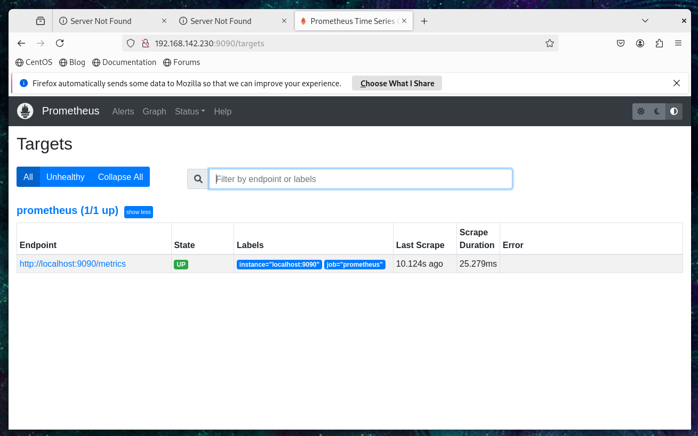
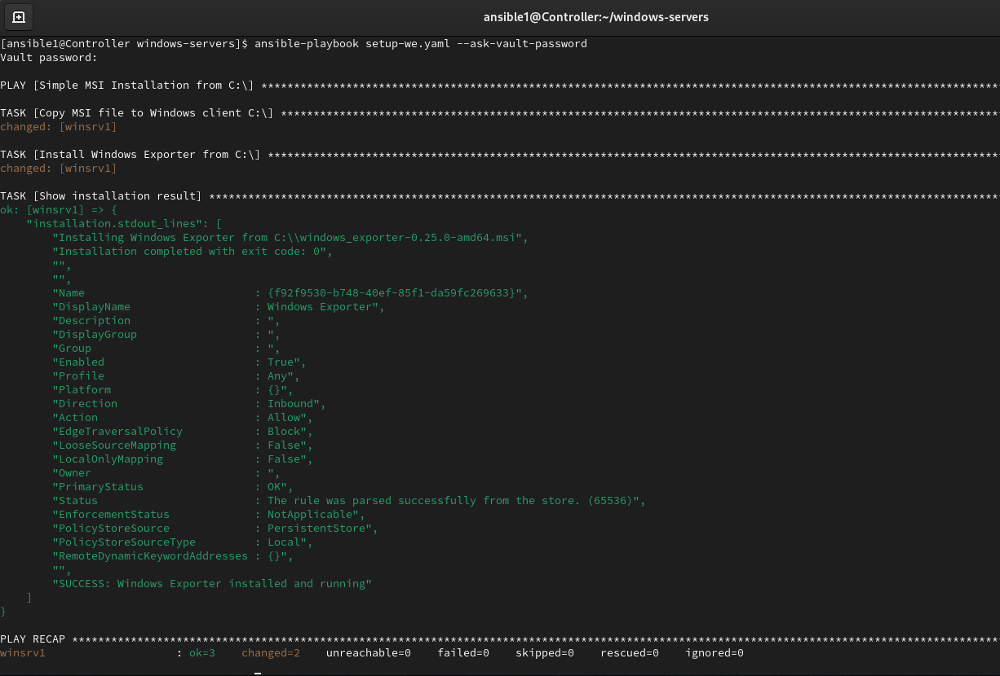
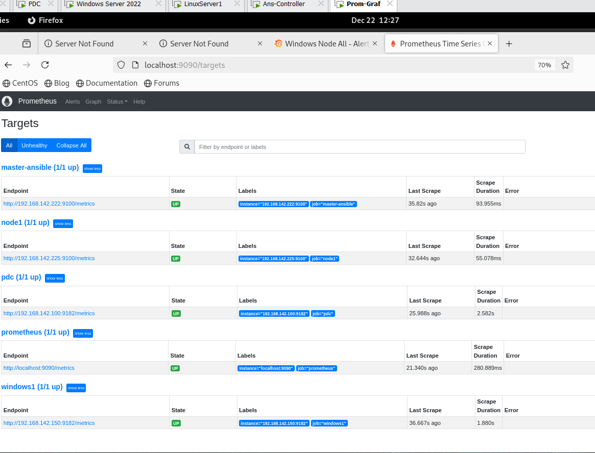

# Enterprise-Level Monitoring Project

## 📝 Project Overview

This project implements an enterprise-level monitoring solution using **Prometheus** and **Grafana**, fully integrated with **Active Directory** and automated via **Ansible**.  
It supports both **Linux** and **Windows** servers in an offline environment, ensuring centralized management, security, and scalability.  

Additionally, the system is configured to send **alerts via email** using an **SMTP server installed on the Domain Controller (DC)**. This enables administrators to receive notifications for critical events on monitored servers in real-time.

**Monitoring + AD Integration + Linux Domain Join + Windows Exporter + Linux Exporter + Ansible Automation + Email Alerts**

## Architecture

My monitoring project consists of the following virtual machines (VMs) and their roles:

- **VM1 (Control)** [192.168.142.222] — Ansible controller for managing Linux & Windows nodes.
- **VM2 (AD / DC + SMTP)** [192.168.142.100] — Windows Server running Active Directory + DNS (Domain Controller) and SMTP server for email alerts.
- **VM3 (Linux node)** [192.168.142.225] — Target Linux node with Node Exporter installed, joined to the AD domain.
- **VM4 (Windows node)** [192.168.142.150] — Target Windows node with Windows Exporter installed, joined to the AD domain.
- **VM5 (Monitor)** [192.168.142.230] — Monitoring server running Prometheus + Grafana.

```
> 💡 **Topology Diagram (Full & Clear Version)**

                       +----------------------+
                       |     VM5: Monitor     |
                       | 192.168.142.230      |
                       | Prometheus + Grafana |
                       +----------+-----------+
                                  ^
                                  |
                  Scrapes Metrics |
                                  |
         ------------------------------------------------
         |                                              |
+--------v---------+                            +-------v--------+
|   VM3: Linux     |                            |  VM4: Windows  |
| 192.168.142.225  |                            |192.168.142.150 |
| Node Exporter    |                            |Windows Exporter|
+--------+---------+                            +-------+--------+
         ^                                              ^
         |                                              |
         | SSH / WinRM                                  | WinRM
         |                                              |
+--------v---------+                            +-------v---------------+
|   VM1: Control   |                            | VM2: AD / DC + SMTP   |
| 192.168.142.222  |----------------------------|192.168.142.100        |
|  Ansible Server  |       Domain Auth          |Active Directory & SMTP|
+------------------+                            +-----------------------+

**Legend:**
- Arrows indicate communication flow:
   * VM1 connects via SSH to Linux nodes and via WinRM to Windows nodes
   * Prometheus on VM5 scrapes metrics from all target nodes
   * Domain Controller (VM2) provides AD authentication and SMTP service for email alerts
```

## Preparing Environment

### Preparing Windows VMs

1. **Active Directory Setup & Domain Join**
   - Install Active Directory on VM2 (AD / DC).
   - Join all Windows servers to the domain `ITI.LOCAL`.
   - Create a domain user `ansible` which will be used by the Ansible control server.
   - Ensure Ansible connects to Windows servers using **WinRM** (default port 5985 must be open).
   - After setup, the `ansible` user can log in to all Windows servers joined to the domain.

2. **GPO Setup for Ansible User**
   - Create an **OU** called `All-Windows-Servers`.
   - Create a **GPO** named `ansible-gpo` and link it to this OU.
   - GPO configuration steps:
     1. **Add Ansible user to local Administrators group**  
        `Computer Configuration → Preferences → Control Panel Settings → Local Users and Groups → New → Local Group (Administrators)`  
        *Add the `ansible` user to this group.*
     2. **Deny local login**  
        `Computer Configuration → Policies → Windows Settings → Security Settings → Local Policies → User Rights Assignment → Deny log on locally`  
        *Add the `ansible` user to this policy.*
     3. **Deny RDP login**  
        `Computer Configuration → Policies → Windows Settings → Security Settings → Local Policies → User Rights Assignment → Deny log on through Remote Desktop Services`  
        *Add the `ansible` user to this policy.*

> ⚠️ **Note:** After applying this GPO, the `ansible` user will **not** be able to log in locally or via RDP on Windows servers. This ensures the user is restricted to remote automation via Ansible only.

## Preparing Linux VMs

### 🔧 Preparing the Linux VMs Environment

Before configuring Ansible, each Linux VM is **joined to the Active Directory domain**. This step is crucial for several reasons:

- **Centralized Identity Management**:  
  Joining Linux nodes to the domain allows all authentication to be handled by Active Directory, providing enterprise-level identity governance.

- **Consistent Hostname Resolution**:  
  Once the Linux VMs are domain members, each node is automatically registered in the domain DNS. Ansible can then communicate using hostnames instead of IPs, which is more stable and scalable.

- **Unified Access Control**:  
  Domain-level policies (sudo mappings, SSH access rules, service accounts) can be applied to Linux machines, ensuring consistent access standards across both Windows and Linux.

- **Better Maintainability & Clean Inventory**:  
  Ansible inventory becomes simplified: only server names are required—no IPs or hard-coded credentials.

Example inventory:

Example:
```
[linux_nodes]
node1
node2
```
> This setup mirrors how large enterprises manage hybrid Linux/Windows environments, ensuring reliability, security, and easier long-term automation.

### 🔹 Preparing Linux Server for Domain Join (Offline Environment)

Before joining the Linux server to the Active Directory (AD) domain, the system must have several required packages installed, such as:

- `realmd`
- `sssd`
- `adcli`
- `samba`
- `krb5-workstation`
- `chrony`
- `oddjob` / `oddjob-mkhomedir`
- `openldap-clients`
- `policycoreutils-python-utils`

These packages are necessary for **Kerberos authentication**, **SSSD communication**, and the **domain join process**.

> **Note:** In this project, the Linux servers are **offline** and cannot access the internet. Therefore, `dnf` has no external repositories to download packages.

#### Creating a Local Repository from ISO

Since the OS was installed from an **ISO image**, all required packages are already available locally. To enable installation without internet access, we need to create a **Local Repository**:

1. **Mount the ISO** (the same ISO used during OS installation)  
2. **Create a Local Repository file** pointing to the mounted ISO  
3. When the server needs any package, `dnf` will install it directly from the ISO instead of fetching it online  

In short:

- The server is offline → `dnf` cannot access external repos  
- Mount the OS ISO → all required packages are available locally  
- Create a Local Repo pointing to the ISO → `dnf` installs packages from it
```
###mount iso
-----------------------------------
df -h
mount /dev/sr0 /media/
ls /media

====================================
##create local repo
--------------------------------------
cd /etc/yum.repos.d/
nano local.repo
==
[Appstream]
name=appstream
baseurl=file:///media/AppStream/
enabled=1
gpgcheck=0

[BaseOs]
name=baseos
baseurl=file:///media/BaseOS/
enabled=1
gpgcheck=0

==
yum repolist
dnf config-manager --enable Local-BaseOS Local-AppStream #To activate the local repositories from the mounted ISO
#dnf config-manager --disable baseos appstream extras-common
```


#### Prepare Hostname, Time, and NTP Before Domain Join

Before performing the domain join, it is important to:

1. **Set the correct hostname**  
   The hostname will be registered in **DNS** and **Active Directory**, so it must be accurate **before** joining the domain.

2. **Configure time, timezone, and NTP**  
   Kerberos authentication is very strict with time.  
   If the server time is not synchronized with the Domain Controller, the domain join will fail.  
   Ensure the server time is fully correct before running the join command.

```
##change hostname
-------------------------------------
hostnamectl set-hostname Prometheus
bash


##sync time from 192.168.142.100
------------------------------------
#tar xfvz tzdata2024a.tar.gz
tar xfvz tzdata2025b.tar.gz
#zic Africa
zic africa
nano /etc/chrony.conf
==
server 192.168.142.100 iburst
==
systemctl enable --now chronyd.service
systemctl restart chronyd.service
timedatectl
chronyc sources
timedatectl
```

Once the hostname, time, and NTP are correctly configured, the server is ready to **join the domain `iti.local`**.

```
##join the domain
----------------------------------
yum install sssd realmd oddjob oddjob-mkhomedir adcli samba-common samba-common-tools krb5-workstation openldap-clients policycoreutils-python-utils -y
realm join -v --user=elham iti.local
realm list
nano /etc/sssd/sssd.conf

==
default_domain_suffix = iti.local
dyndns_update = truedyndns_update = True
ad_hostname = %h.%d               # hostname.full_domain
dyndns_refresh_interval = 43200   #to_renew_dns_record_every_12_hours
dyndns_update_ptr = true
dyndns_auth = GSS-TSIG
==
#kinit elham@ITI.LOCAL
#klist
systemctl restart sssd
realm list
```
We will perform the same steps for the other Linux VM (node1) to join it to the domain.

### Installing Ansible on the Linux Controller VM

In a standard enterprise setup using RHEL servers, **Ansible Core** can be installed directly from the mounted RHEL installation ISO, as the required packages are already included.

However, in this project we are using **CentOS Stream 9**, whose installation ISO does **not** provide Ansible Core. Therefore, we installed Ansible Core from the **EPEL repository** immediately after creating the VM, before proceeding with the domain join and the rest of the configuration.

```
sudo yum update -y   # update system 
sudo yum install epel-release -y
sudo yum install ansible -y
ansible --version
```
## Prerequisites

Before running the Ansible playbooks, ensure the following **on each target server**:

1. **Create a local user on all Linux servers**  
   A local user named `ansible1` must exist on each target server. This user will be used by Ansible to connect and execute tasks.

2. **Set a secure password for the user**  
   Make sure to set a strong password for `ansible1`. This password can be used temporarily if password-based authentication is enabled, but it is recommended to configure **SSH key-based authentication** for enhanced security.

3. **Grant sudo privileges**  
   The `ansible1` user must have passwordless sudo access to perform administrative tasks. You can add the following line to the sudoers file using `visudo`:

```
sudo useradd ansible1 #this user is special to ansible for ssh (linux servers) 
sudo passwd ansible1
#to grant ansible1 usr sudo permissions with no password
echo "ansible1 ALL=(ALL) NOPASSWD: ALL" | sudo tee /etc/sudoers.d/ansible1    #or can be added directly to /etc/suduoers
su - ansible1
ssh-keygen -t rsa -b 4096
```

In this environment, Linux hosts are not automatically registered in DNS.  
To avoid unnecessary DNS changes and approval workflows, hostname resolution is handled locally using `/etc/hosts`, while the Ansible inventory relies on hostnames only.

```
sudo nano /etc/hosts
==
192.168.142.225    node1     node1
==
ssh-copy-id ansible1@node1  
sudo nano /etc/ansible1/hosts
==
[linux_nodes]
node1
==
ansible -m ping linux_nodes    #for test
#pywinrm install (package requird for linux to deal with windows)
sudo apt install python3-pip -y
```
As the server is **offline**, you can download PyWinRM and its dependencies on a device with internet access, then transfer and install them on the offline server.  
So on your online device, do:

```
mkdir pywinrm_offline   # Create a folder to store PyWinRM packages
cd pywinrm_offline
pip download pywinrm    # Download PyWinRM and its dependencies
scp *.whl ansible1@192.168.142.222:/tmp/pywinrm_offline/          # Transfer all downloaded files to the offline server
```

On the offline Ansible control server:

```
cd /tmp/pywinrm_offline
pip install --user --no-index --find-links=. pywinrm   #--no-index option tells pip to avoid looking online, and --find-links= points to the local folder containing the packages.
pip show pywinrm | grep Version
```

## Separate Inventory for Windows Hosts

This project keeps **Linux and Windows inventories separate** for clarity and security.

### Create a dedicated folder for Windows inventory
On your Ansible control server, create a new folder specifically for all Windows hosts:

```
su - ansible1
cd
mkdir windows-servers
cd windows-servers

```

### Create a Windows Inventory File

Inside the `windows-servers` folder, create your inventory file, e.g., `inventory.ini`:

```
nano inventory.ini
===
[all:vars]
ansible_user=iti\ansible
ansible_password="{{ ansible_password }}"
ansible_connection=winrm
ansible_winrm_port=5985
ansible_winrm_server_cert_validation=ignore
ansible_winrm_transport=ntlm

#[DomainController]
#pdc ansible_host=192.168.142.100

[windows_nodes]
winsrv1 ansible_host=192.168.142.150
===
```
Sensitive credentials like `ansible_password` are referenced via Ansible Vault.  

This ensures no plain passwords are stored in the inventory.

## Handling Vault Password: Create, Use, and Secure

This project uses Ansible Vault to protect sensitive data and credentials.  
Follow these practical steps to create a vault password file, configure `ansible.cfg`, and run playbooks safely.

### Step 1: Create a Vault Password File
Create a file containing only the vault password (replace `<your-password>`):

```
echo '<your-password>' > /home/ansible1/windows-servers/.vault_pass.txt
```
#### Restrict File Permissions

Restrict file permissions so only the Ansible user can read it:

```
chmod 600 /home/ansible1/windows-servers/.vault_pass.txt
```

### Step 2: Configure Ansible to Use the Vault Password File

Update your `ansible.cfg` to reference the vault password file. This ensures that playbooks can be run without manually entering the vault password each time.

In your project’s ansible.cfg (or create one inside `windows-servers`), add:

```
nano /home/ansible1/windows-servers/ansible.cfg
===
[defaults]
vault_password_file = /home/ansible1/windows-servers/.vault_pass.txt
inventory = /home/ansible1/windows-servers/inventory.ini
===
```

### Step 3: Create or Edit Vaulted Files

Create a new vaulted file for storing credentials. This ensures sensitive data like passwords and API keys are encrypted and protected.

```
ansible-vault create /home/ansible1/windows-servers/group_vars/all/vault.yml
===
ansible_password: "DOMAIN_USER_REAL_PASSWORD"
===
```
#### Edit an Existing Vaulted File

To update or modify an existing vaulted file, use Ansible Vault’s edit command. This allows you to securely make changes without exposing sensitive information.

```
ansible-vault edit /home/ansible1/windows-servers/group_vars/all/vault.yml
```
#### Reference Vaulted Credentials in Inventory

Store sensitive data like `ansible_password` in vaulted files, and reference them in your inventory using `{{ ansible_password }}` to keep credentials secure and avoid plain-text exposure.

### Step 4: Testing Ansible Connectivity ✅

Before running playbooks, you should test that the Ansible control server can communicate with both Linux and Windows target servers.

- **Test Linux nodes:**
```bash
ansible -m ping linux_nodes
```
- **Test Linux nodes:**
```
ansible -m win_ping windows_nodes -i windows-servers/inventory.ini --ask-vault-pass
```


### 💻 Installing Prometheus on Linux VM

This section describes the steps to install and configure **Prometheus** on a Linux virtual machine. It ensures that the monitoring server is ready to scrape metrics from all target nodes.
on linux server do :
```
sudo useradd --no-create-home --shell /bin/false prometheus
sudo mkdir /etc/prometheus
sudo mkdir /var/lib/prometheus
sudo chown prometheus:prometheus /var/lib/prometheus
```
#### 📦 Installing Prometheus (Offline Method)

As the server is **offline**, download the Prometheus package on a device with internet access, then transfer it to the offline server. On your online device, run:

```
cd /tmp/
wget https://github.com/prometheus/prometheus/releases/download/v2.35.0/prometheus-2.35.0.linux-amd64.tar.gz
```
Alternatively, you can download Prometheus directly from its official release page:  
https://github.com/prometheus/prometheus/releases/download/v2.35.0/prometheus-2.35.0.linux-amd64.tar.gz  

After transferring the Prometheus package to the offline server, run:

```
tar -xvf prometheus-2.35.0.linux-amd64.tar.gz
cd prometheus-2.35.0.linux-amd64/
sudo mv console* /etc/prometheus 
sudo mv prometheus.yml /etc/prometheus
sudo chown -R prometheus:prometheus /etc/prometheus
sudo mv prometheus /usr/local/bin/
sudo chown prometheus:prometheus /usr/local/bin/prometheus
sudo vi /etc/systemd/system/prometheus.service
============================================================
[Unit]
Description=Prometheus
Wants=network-online.target
After=network-online.target

[Service]
User=prometheus
Group=prometheus
Type=simple
ExecStart=/usr/local/bin/prometheus \
  --config.file=/etc/prometheus/prometheus.yml \
  --storage.tsdb.path=/var/lib/prometheus \
  --web.console.templates=/etc/prometheus/consoles \
  --web.console.libraries=/etc/prometheus/console_libraries

Restart=always

[Install]
WantedBy=multi-user.target
==============================================================
sudo semanage fcontext -a -t bin_t "/usr/local/bin/prometheus"
sudo restorecon -v /usr/local/bin/prometheus
sudo setenforce 1
###open-needed-port-9090
sudo systemctl status prometheus.servicesudo firewall-cmd --add-port=9090/tcp --permanent
sudo firewall-cmd --reload
sudo systemctl daemon-reload
sudo systemctl enable prometheus
sudo systemctl start prometheus
sudo systemctl status prometheus

## http:192.168.142.230:9090 #for_test_on_any_browser
```



### 💻 Installing Grafana on the same Linux VM running Prometheus

To install Grafana, follow the steps below:

1. Download the **Grafana Enterprise RPM package** for RedHat/CentOS from:  
   https://dl.grafana.com/grafana-enterprise/release/12.3.1/grafana-enterprise_12.3.1_20271043721_linux_amd64.rpm

2. Transfer the downloaded file to your server — preferably to the `/tmp/` directory.

```
cd /tmp/ #the offline package must be located to any path and go to that path and use rpm to install from a file
sudo rpm --install --verbose -h /tmp/grafana-enterprise_12.3.1_20271043721_linux_amd64.rpm

sudo semanage port -a -t http_port_t -p tcp 3000
sudo firewall-cmd --add-port=3000/tcp --permanent
sudo firewall-cmd --reload

sudo /bin/systemctl daemon-reload
sudo /bin/systemctl enable grafana-server.service
### You can start grafana-server by executing
sudo /bin/systemctl start grafana-server.service

#http:192.168.142.230:3000    #for test grafana write this ip on the browser of any server joined the domain the default username:admin password:admin
```

#### 📦 Installing windows_exporter on Windows Servers via Ansible

To install **windows_exporter** on Windows machines using Ansible:

1. On an online computer, download the installer file:  
   **windows_exporter-0.25.0-amd64.msi**  
   https://github.com/prometheus-community/windows_exporter/releases/download/v0.25.0/windows_exporter-0.25.0-amd64.msi

2. Since the servers are offline, transfer the MSI file to your Ansible control server.

3. Use the playbook located at:  
   **/home/ansible1/windows-servers/setup-we.yaml**  
   to deploy and install *windows_exporter* on all Windows hosts.

```
- name: Simple MSI Installation from C:\
  hosts: all
  gather_facts: no
  
  tasks:
    - name: Copy MSI file to Windows client C:\ 
      win_copy:
        src: /home/ansible1/windows-servers/windows_exporter-0.25.0-amd64.msi
        dest: C:\windows_exporter-0.25.0-amd64.msi
        force: yes
        backup: yes
      register: copy_operation

    - name: Install Windows Exporter from C:\
      win_shell: |
        # Verify MSI file exists
        $msiPath = "C:\windows_exporter-0.25.0-amd64.msi"
        if (-not (Test-Path $msiPath)) {
            Write-Error "MSI file not found at $msiPath"
            exit 1
        }
        
        Write-Host "Installing Windows Exporter from $msiPath"
        
        # Install the MSI
        $process = Start-Process "msiexec" -ArgumentList @(
            "/i", "C:\windows_exporter-0.25.0-amd64.msi",
            "/quiet",
            "/norestart",
            "ENABLED_COLLECTORS=cpu,memory,net,service,process,logical_disk,os,iis",
            "LISTEN_PORT=9182"
        ) -Wait -PassThru -NoNewWindow
        
        Write-Host "Installation completed with exit code: $($process.ExitCode)"
        
        # Wait and start service
        Start-Sleep -Seconds 10
        Start-Service -Name "windows_exporter" -ErrorAction SilentlyContinue
        
        # Configure firewall
        $firewall = Get-NetFirewallRule -DisplayName "Windows Exporter" -ErrorAction SilentlyContinue
        if (-not $firewall) {
            New-NetFirewallRule -DisplayName "Windows Exporter" -Direction Inbound -Protocol TCP -LocalPort 9182 -Action Allow
        }
        
        # Verify installation
        $service = Get-Service -Name "windows_exporter" -ErrorAction SilentlyContinue
        if ($service -and $service.Status -eq 'Running') {
            Write-Host "SUCCESS: Windows Exporter installed and running"
            exit 0
        } else {
            Write-Error "Installation verification failed"
            exit 1
        }
      args:
        executable: powershell
      register: installation

    - name: Show installation result
      debug:
        var: installation.stdout_lines
```
#### 🖥️ Run the Windows Exporter Playbook from the Master Ansible Server

On the Master Ansible Server, execute the following command to install Windows Exporter on all target Windows nodes:

```
cd /home/ansible1/windows-servers
ansible-playbook setup-we.yaml --ask-vault-password
```

This command will prompt you for the Vault password to securely access credentials stored in the vaulted files.



##### ⚠️ Important Notes

- You must install **windows_exporter-0.25.0-amd64.msi** manually on the Domain Controller (**pdc.iti.local**).
- Ensure **port 9182** is open on all Windows servers so Prometheus can scrape metrics.

To open the port, run the following in **PowerShell as Administrator**:

```
New-NetFirewallRule `
  -DisplayName "Prometheus Only 9182" `
  -Direction Inbound `
  -Protocol TCP `
  -LocalPort 9182 `
  -RemoteAddress 192.168.142.230 `
  -Action Allow
```
#### 🐧 Installing Node Exporter on Linux Servers via Ansible

To install **node_exporter**, download the package on an online machine, then transfer it to the offline server:

- Download: **node_exporter-1.3.1.linux-amd64.tar.gz**  
  https://github.com/prometheus/node_exporter/releases/download/v1.3.1/node_exporter-1.3.1.linux-amd64.tar.gz

After transferring the file to the server, use the playbook:

📌 `/home/ansible1/node-exporter/setup-ne.yaml`

This playbook runs a shell script that installs Node Exporter on all Linux servers.

##### 📂 node-exporter Directory Content

The following files exist inside `/home/ansible1/node-exporter/`:

1. `setup-ne.yaml` — **This is the Ansible Playbook** responsible for installing and configuring Node Exporter on Linux servers.

```
- name: installing node-exporter for linux servers for monitoring
  hosts: all
  tasks:
    - name: Copy tar file from ansible to worker
      copy:
        src: /home/ansible1/node-exporter/node_exporter-1.3.1.linux-amd64.tar.gz
        dest: /tmp/

    - name: Copy script file  to worker
      copy:
        src: /home/ansible1/node-exporter/node-script.sh
        dest: /tmp/
    - name: Execute script with shell
      shell: sh /tmp/node-script.sh
      args:
        chdir: /tmp/
```

2. `node-script.sh` — **This is the Shell Script** executed by the playbook to perform the installation steps.

```
sudo useradd --no-create-home --shell /bin/false node_exporter

cd /tmp/
tar -xvf node_exporter-1.3.1.linux-amd64.tar.gz
cd node_exporter-1.3.1.linux-amd64

sudo mv node_exporter /usr/local/bin/
sudo chown node_exporter:node_exporter /usr/local/bin/node_exporter

sudo tee /etc/systemd/system/node_exporter.service <<EOF
[Unit]
Description=Node Exporter
After=network.target

[Service]
User=node_exporter
Group=node_exporter
Type=simple
ExecStart=/usr/local/bin/node_exporter

[Install]
WantedBy=multi-user.target
EOF

sudo restorecon -v /usr/local/bin/node_exporter
sudo systemctl daemon-reload
sudo systemctl start node_exporter
sudo systemctl enable node_exporter

echo "Node Exporter has been installed and started."
```

#### 🐧 Run the Node Exporter Playbook from the Master Ansible Server

To install Node Exporter on all target Linux servers, execute the following command on the Master Ansible Server:
```
ansible-playbook /home/ansible1/node-exporter/setup-ne.yaml --ask-vault-password
```

This command runs the Ansible playbook which, in turn, executes the included shell script to install Node Exporter on all Linux nodes. You will be prompted for the Vault password to securely access any stored credentials.

##### 📌 Note  
You must install `node_exporter-1.3.1.linux-amd64.tar.gz` **manually on the Ansible Master server**.

#### 🔓 Open Port 9100 on all Linux servers for Prometheus scraping  
Run the following commands on each Linux node:

```
sudo firewall-cmd --zone=public --add-port=9100/tcp --permanent
sudo firewall-cmd --reload
sudo firewall-cmd --list-ports
```




